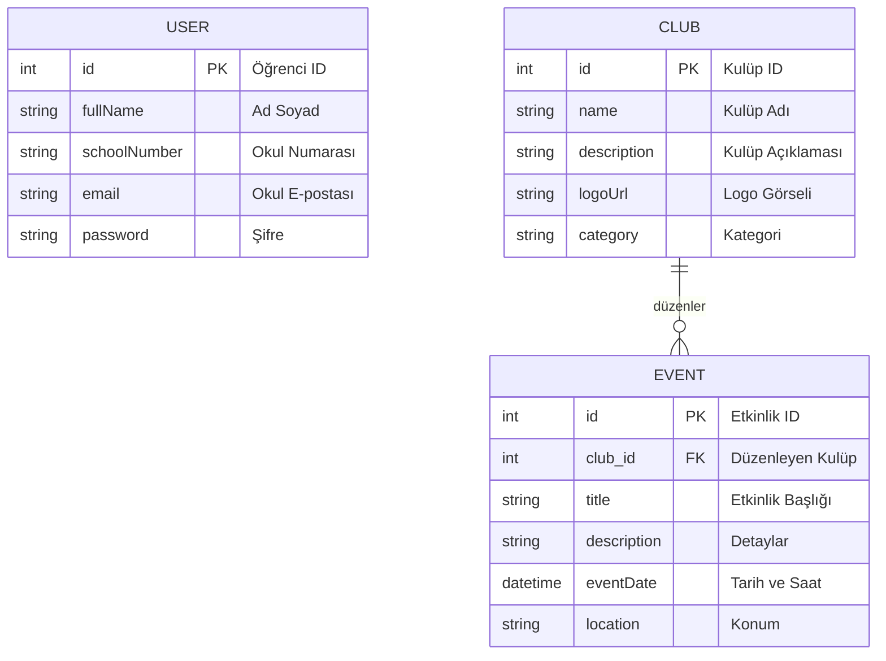

# 🚀 Üniversite Öğrenci Kulübü Uygulaması (BugBusters Squad)

Bu proje, **"MTH4710 – Yazılım Sektöründe Çevik Dönüşüm ve Uygulama Pratikleri"** dersi kapsamında geliştirilen, öğrencilerin kulüplere katılımını ve etkileşimini dijitalleştiren bir yönetim sistemidir.

## 📅 Proje Durumu ve Sprint İlerleyişi

Projemiz Çevik (Agile) prensiplerle, **2 Haftalık Sprintler** halinde geliştirilmektedir.

### ✅ Sprint 0: İskelet Proje (Tamamlandı)
* **Hedef:** Uçtan uca çalışan minimal bir akış (DB → API → UI) oluşturmak.
* **Çıktı:** Veritabanından okunan sistem duyurusunun arayüzde gösterilmesi sağlandı.

### ✅ Sprint 1: Temel Fonksiyonlar (Tamamlandı - Mevcut Sürüm)
Bu sprintte projenin temel kullanıcı etkileşimleri geliştirilmiştir:
* [cite_start]**🔐 Kullanıcı Girişi (Login):** Öğrencilerin kullanıcı adı ve şifre ile sisteme güvenli giriş yapabilmesi sağlandı [cite: 101-104].
* **📋 Kulüp Listeleme:** Veritabanına kayıtlı öğrenci kulüplerinin (İsim, Logo, Açıklama) ana sayfada listelenmesi tamamlandı.
* **Teknik Altyapı:** Entity Framework modelleri (User, Club) ve Controller yapıları kuruldu.

### 🔜 Sprint 2: Detaylar ve Etkinlikler (Planlandı)
Önümüzdeki sprintte hedeflenen özellikler:
* **Kulüp Detay Sayfası:** Seçilen kulübün detaylı bilgilerinin görüntülenmesi.
* **Etkinlik Yönetimi:** Kulüplerin düzenlediği etkinliklerin listelenmesi ve katılım butonu.
* [cite_start]**Üyelik Başvurusu:** Öğrencilerin kulüplere "Üye Ol" isteği gönderebilmesi[cite: 1781].

## 🗄️ Veritabanı Tasarımı (Sprint 1.0 MVP)

Bu proje **Agile (Çevik)** prensiplerle geliştirilmektedir. Bu nedenle veritabanı tasarımımız **"Evrimsel Veritabanı Tasarımı"** (Evolutionary Database Design) yaklaşımıyla hazırlanmıştır.

Şu anki **Sprint 1.0** hedefimiz sadece şunlardır:
1. Öğrencilerin sisteme kaydolması.
2. Kulüplerin listelenmesi.
3. Etkinliklerin görüntülenmesi.

Bu nedenle veritabanında **"Membership" (Üyelik)** gibi tablolar bilinçli olarak **bulunmamaktadır**. Bu özellikler Sprint 1.1 kapsamındadır ve zamanı geldiğinde eklenecektir (YAGNI Prensibi).

### 📷 ER Diyagramı Görseli


### 🛠️ Yapısal Detaylar (Mermaid Kodu)
Geliştirici ekibin üzerinde çalışması ve ileride düzenlemesi için şema kodumuz:


---

## 🛠️ Teknoloji Yığını

* **Backend:** C# (.NET 7 Web API)
* **Frontend:** TypeScript (React)
* **Database:** MySQL
* **ORM:** Entity Framework Core
* **Süreç Yönetimi:** Jira & GitHub

## 🏃‍♂️ Proje Nasıl Çalıştırılır?

Proje `backend` ve `frontend` olmak üzere iki ana bölümden oluşur. Güncel kod `main` branch'inde bulunmaktadır.

### 1. Backend (C# / .NET API)

Backend sunucusunu ayağa kaldırmak ve veritabanını güncellemek için:

1.  Projenin `backend/` klasörüne gidin.
2.  `appsettings.json` dosyasındaki `ConnectionStrings` bölümünü kendi yerel MySQL bilgilerinizle güncelleyin.
3.  **Önemli:** Yeni eklenen tabloları (Users, Clubs) oluşturmak için migration komutunu çalıştırın:
    ```bash
    dotnet ef database update
    ```
4.  API sunucusunu başlatın:
    ```bash
    dotnet run
    ```
5.  Sunucu `http://localhost:3000` adresinde çalışacaktır.

### 2. Frontend (TypeScript / React)

Kullanıcı arayüzünü ayağa kaldırmak için:

1.  Yeni bir terminal açın ve `frontend/` klasörüne gidin.
2.  Paketleri yükleyin:
    ```bash
    npm install
    ```
3.  Uygulamayı başlatın:
    ```bash
    npm start
    ```
4.  Tarayıcınızda `http://localhost:5173` adresine giderek Login ekranını ve Kulüp Listesini görebilirsiniz.

## 📋 Jira Süreç Takibi

Projemizin tüm çevik planlaması, User Story'ler, Task'ler ve Sprint Burndown grafikleri Jira bordumuz üzerinden şeffaf bir şekilde takip edilmektedir:

🔗 **[BugBusters Jira Board](https://bugbusterssquad.atlassian.net/jira/software/projects/SCRUM/boards/1)**

---
*Geliştirici Ekip: BugBusters Squad*
