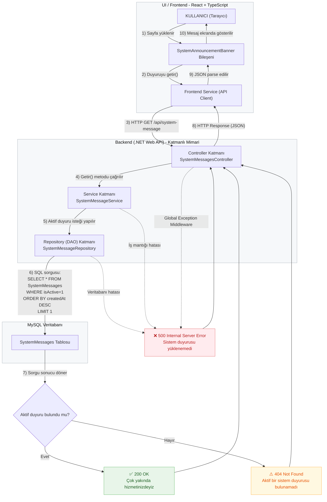

# Mimari Özeti - Üniversite Öğrenci Kulübü Uygulaması (Sprint 0)

**Takım:** Bugbusters Squad
**Tarih:** 29 Ekim 2025

Bu doküman, Sprint 0 hedefi olan "Uçtan uca çalışan minimal akış (DB → API → UI)" için kurulan iskelet projenin teknik mimarisini ve veri akışını özetlemektedir.

Bu özet, "Proje Dokümantasyonu ve Kurulum Talimatları" task'i kapsamında hazırlanmıştır.

## 1. Seçilen Teknoloji Yığını

* **Backend (API):** C# (.NET Web API)
* **Frontend (UI):** TypeScript (React)
* **Veritabanı (DB):** MySQL
* **Süreç Yönetimi:** Jira
* **Versiyon Kontrol:** Git (GitHub)

## 2. Mimari Felsefesi ve Veri Akışı

Projemiz, "Katmanlı Mimari" felsefesine (Separation of Concerns) dayanmaktadır.

### Backend Mimarisi

Backend, "Backend Katmanlı Mimari Oluşturma" task'inde belirtildiği gibi 3 ana katmandan oluşur:

1.  **Controller Katmanı:** Dış dünyadan (Frontend'den) gelen HTTP isteklerini karşılar. `Servis Katmanı`'nı çağırır.
2.  **Service Katmanı:** Projenin iş mantığını (business logic) içerir. Doğrudan veritabanıyla konuşmaz, `Repository Katmanı`'nı çağırır.
3.  **Repository (DAO) Katmanı:** Doğrudan veritabanı (MySQL) ile konuşan tek katmandır. Veritabanından veriyi okur.

### Uçtan Uca Veri Akış Diyagramı (DB → API → UI)


## 3. Kullanılan API Endpoint ve Örnek JSON

Sprint 0 kapsamında sadece bir adet API endpoint'i hazırlanmıştır.

* **Metot:** `GET`
* **Adres (Endpoint):** `/api/system-message`
* **Açıklama:** Veritabanındaki (MySQL) `SystemMessages` tablosundan aktif olan duyuru metnini (`messageText`) getirir.

---

### Örnek Yanıtlar (JSON)

"Hata Yönetimi" ve "Kabul Kriterleri" göz önünde bulundurularak 3 durum da ele alınmıştır:

**Durum 1: Duyuru bulunduğunda (Başarılı - 200 OK)**
*Kabul Kriteri: Sistem Mesajının Görünürlüğü*

```json
{
  "messageText": "Çok yakında hizmetinizdeyiz"
}
```
**Durum 2: Aktif duyuru bulunamadığında (Bulunamadı - 404 Not Found) Kabul Kriteri: Mesaj Olmadığında**
```json
{
  "error": "Aktif bir sistem duyurusu bulunamadı."
}
```
**Durum 3: Sunucu hatası oluştuğunda (İç Sunucu Hatası - 500 Internal Server Error) Kabul Kriteri: Hata Durumunda**
```json
{
  "error": "Sistem duyurusu yüklenemedi"
}
