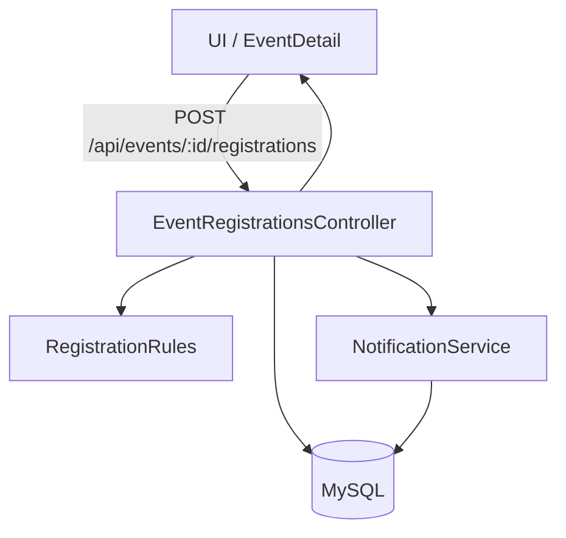

# Mimari Özeti - BugBusters GO (v1.2)

**Takım:** BugBusters Squad  
**Tarih:** 2026-01-05

Bu doküman, mevcut v1.2 kapsamındaki backend/ frontend mimarisini ve temel akışları özetler.

## 1) Teknoloji Yığını

- **Backend:** C# (.NET 8 Web API)
- **Frontend:** React + TypeScript (Vite)
- **DB:** MySQL (EF Core)
- **Auth:** JWT Bearer
- **Dosya saklama:** Local storage (event documents)

## 2) Mimari Yapı

Backend, katmanlı ve servis odaklıdır:

1. **Controller Katmanı:** HTTP uçlarını karşılar, yetki ve temel doğrulamaları yapar.
2. **Service Katmanı:** İş kuralları (Audit, Analytics, Notification, Access, DocumentStorage).
3. **Data Katmanı:** EF Core `AppDbContext` + migrations + seed.
4. **Middleware:** Request logging + exception handling + rate limiting.

Frontend, sayfa bazlı (pages) ve API client (services) ayrımıyla yapılandırılmıştır.

## 3) Örnek Akış: Etkinliğe Kayıt + Waitlist

Kayıt sırasında kapasite doluysa `Waitlist` statüsü atanır; iptal olduğunda ilk sıradaki kullanıcı otomatik olarak `Registered` olur ve bildirim alır.

## 4) Örnek Akış: SKS Belge İncelemesi

- Kulüp admin belge yükler → `SksEventDocumentsController`
- Dosya local storage’a kaydedilir
- SKS admin inceleyip onaylar/reddeder
- Audit log + bildirim kaydı oluşturulur

## 5) Operasyonel Notlar

- Health endpointleri: `/health`, `/ready`
- Migrationlar uygulama başlangıcında çalışır (`MIGRATE_ON_STARTUP=true`)
- Ayrıntılar için: `docs/RUNBOOK.md`, `docs/DB.md`
